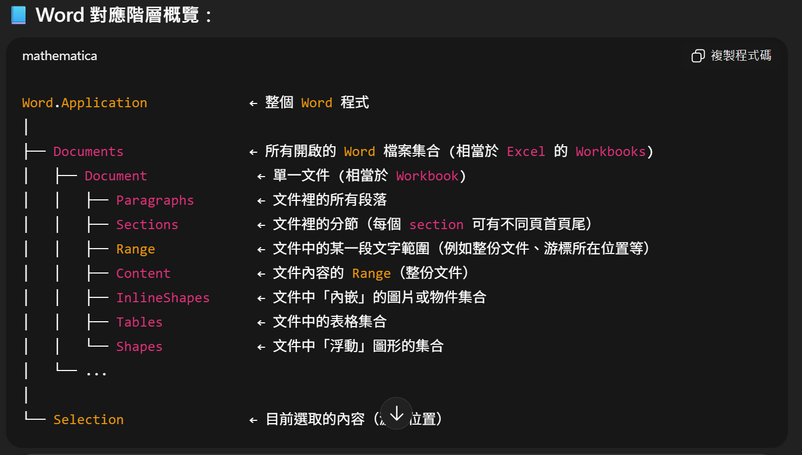

# 🧭 ExcelToWord 專案架構筆記

---

## 📂 專案分層說明

| 專案名稱 | 分層角色 | 功能說明 |
|-----------|-----------|-----------|
| **ExcelToWord** | 🏁 主程式層 (Entry Layer) | 啟動應用程式、載入設定、建立服務並呼叫執行流程 |
| **ExcelToWord_Configurement** | ⚙️ 設定層 (Configuration Layer) | 儲存所有可調整的設定，如 Excel 路徑、命名範圍、延遲時間等 |
| **ExcelToWord_Service** | 🔧 服務層 (Service Layer) | 核心邏輯所在，負責操作 Excel 與 Word（含介面與實作） |
| **ExcelToWord_Models** | 📦 資料模型層 (Domain / Models Layer) | 定義資料結構，目前暫時未用，日後可擴充（如測試項、報表結果物件） |
| **ExcelToWord_Utilities** | 🧰 工具層 (Utilities Layer) | 放置通用工具（例如日誌、檔案路徑、字串格式化工具等），目前未使用但保留擴充彈性 |

---

## 🧩 ExportSettings.cs

> **Namespace：** `ExcelToWord_Configurement`  
> 匯出設定類別 — 集中管理所有可配置的參數

```csharp
using System;

namespace ExcelToWord_Configurement
{
    /// <summary>
    /// 匯出設定類別，集中管理所有可配置的參數
    /// </summary>
    public class ExportSettings
    {
        // 1️⃣ Excel 來源檔案路徑
        /// <summary>Excel 來源檔案路徑</summary>
        /// <remarks>
        /// 字串前面的 <c>@</c> 用來讓字串中的「反斜線」不需要再轉義。
        /// - 沒有 @ 時：你要打兩個反斜線 `\\` 才能表示一個真正的 `\`。
        /// - 有 @ 時：反斜線會被當成普通字元，更符合實際檔案路徑的寫法。
        /// </remarks>
        public string ExcelPath { get; set; } = @"C:\Reports\5GNR_3.7GHz_4.5GHz.xlsx";

        // 2️⃣ Word 輸出資料夾
        /// <summary>Word 報表輸出的資料夾路徑</summary>
        public string OutputFolder { get; set; } = @"C:\Reports\WordOutputs_ByItem";

        // 3️⃣ 要匯出的命名範圍清單
        /// <summary>要匯出的命名範圍清單</summary>
        /// <remarks>
        /// <c>string[]</c> 代表「字串陣列」。
        /// 
        /// 以下兩種寫法等價：
        /// ```csharp
        /// string[] names = { "A", "B", "C" };
        /// string[] names = new string[] { "A", "B", "C" };
        /// ```
        /// 因為 C# 會自動補上型別宣告，這稱為「陣列初始化簡寫」。
        /// </remarks>
        public string[] TargetNames { get; set; } = { "ACL_1", "ACLN_1" };

        // 4️⃣ 開始處理的工作表索引
        /// <summary>從 Excel 活頁簿中第幾張工作表開始處理</summary>
        public int StartSheetIndex { get; set; } = 7;

        // 5️⃣ 貼入 Word 圖片的統一寬度
        /// <summary>貼到 Word 文件中圖片的統一寬度（單位：公分）</summary>
        public float ImageWidthCm { get; set; } = 15f; // 使用 15f 確保型別為 float

        // 6️⃣ 每次操作後的延遲時間（毫秒）
        /// <summary>每次操作 COM 物件後的延遲時間（毫秒）</summary>
        /// <remarks>
        /// 用於防止 COM 阻塞問題，特別是在頻繁操作 Office 應用程式時。
        /// </remarks>
        public int DelayMs { get; set; } = 150;

        /* 🧠 延伸範例：自訂 Getter / Setter（僅示範用途）
        private int _internalDelayMs = 200;

        public int DelayMs
        {
            get
            {
                // 每次取得都回傳固定值 150
                return 150;
            }
            set
            {
                // 當有人嘗試設定值時，執行自訂邏輯
                Console.WriteLine($"有人試圖設定 DelayMs = {value}，但我們忽略它。");
                _internalDelayMs = 200; // 不使用外部給的 value
            }
        }
        */
    }
}
```
---
# 🧩 IExcelService 介面筆記

---

## 📘 檔案結構與命名空間

```csharp
using Excel = Microsoft.Office.Interop.Excel;

namespace ExcelToWord_Service
{
    /// <summary>
    /// Excel 操作服務介面
    /// 定義所有 Excel 相關操作的契約
    /// </summary>
    public interface IExcelService
    {
        /// <summary>
        /// 取得工作簿（Excel 檔案）
        /// </summary>
        /// <remarks>
        /// - 這是一個唯讀屬性，提供目前開啟的 Excel 活頁簿給外部使用。  
        /// - Excel.Workbook：屬性的型別 → 代表一個 Excel 檔案（活頁簿）。  
        /// - Workbook：屬性的名稱。
        /// </remarks>
        Excel.Workbook Workbook { get; }

        /// <summary>
        /// 取得指定工作表的命名範圍
        /// </summary>
        /// <remarks>
        /// - Excel.Range：方法的回傳型別 → 表示會回傳一個範圍物件（Range）。  
        /// - Excel.Worksheet ws：Excel 裡的一張「工作表」，參數名稱 ws 是常見縮寫（worksheet）。  
        /// - string rangeName：名稱管理員中的「命名範圍」，例如「ACL_1」指向一塊儲存格區域。
        /// </remarks>
        Excel.Range GetNamedRange(Excel.Worksheet ws, string rangeName);

        /// <summary>
        /// 關閉 Excel 並釋放資源
        /// </summary>
        void Close();
    }
}

Excel.Application        →  整個 Excel 程式本體
└── Workbooks            →  活頁簿集合
    └── Workbook         →  單一 Excel 檔案
        └── Worksheets   →  工作表集合
            └── Worksheet →  單一工作表 (Sheet)
                └── Range →  儲存格或範圍
```

開啟excel
從第7張工作表開始
對每張表找命名範圍ACL_1 / ACLN_1
複製圖片到剪貼簿
將圖片貼上Word
關閉excel

開啟檔案 OpenWordbook(path,visible)
走訪工作表 EnmerateWorksheets(startIndex)
找命名範圍 TryGetNameRange()
複製範圍成圖片 CopyRangePictureToClipboard(range,format)
資源釋放 Close()

ExcelService：只處理 Excel 讀取與複製圖片到剪貼簿
WordService： 只處理 Word  貼上、定位游標、縮放圖片
Clipboard/Retry：可作為獨立 Helper（或暫時先放 ExcelService 內）

MVP 先小後大

先完成「能跑的最小路徑」

再補齊：錯誤處理、工作簿/工作表雙層命名範圍、Retry、單位轉換等

Application → Workbooks → Workbook → Worksheets → Worksheet → Range



